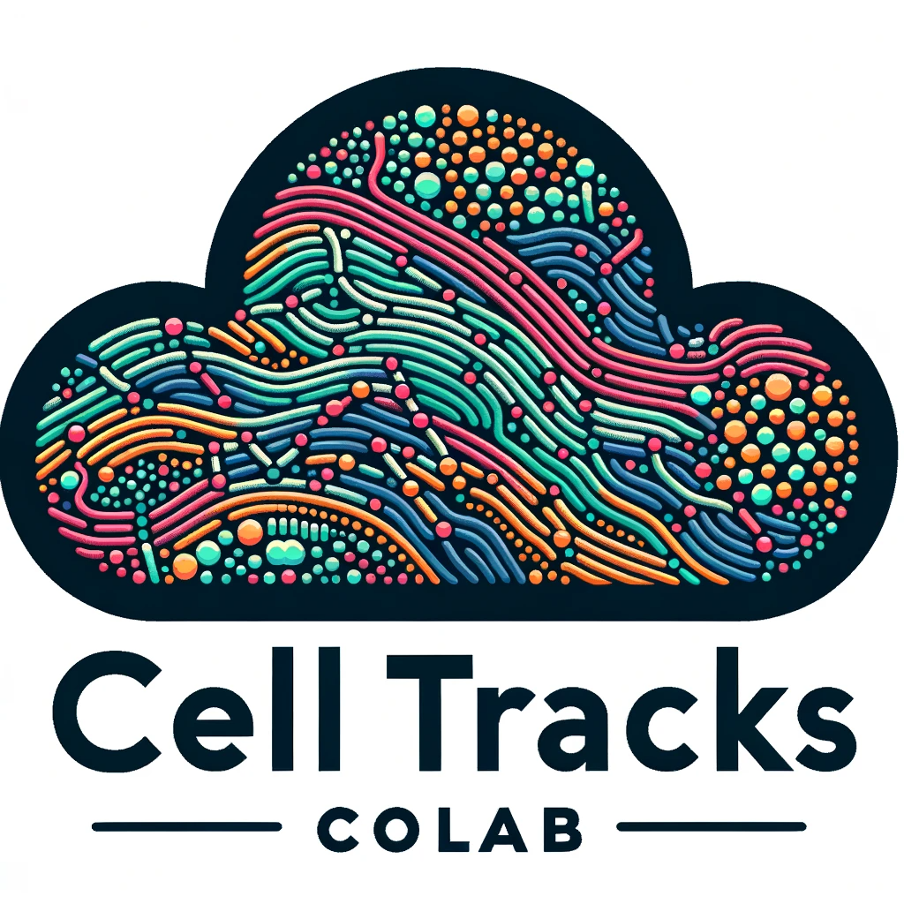
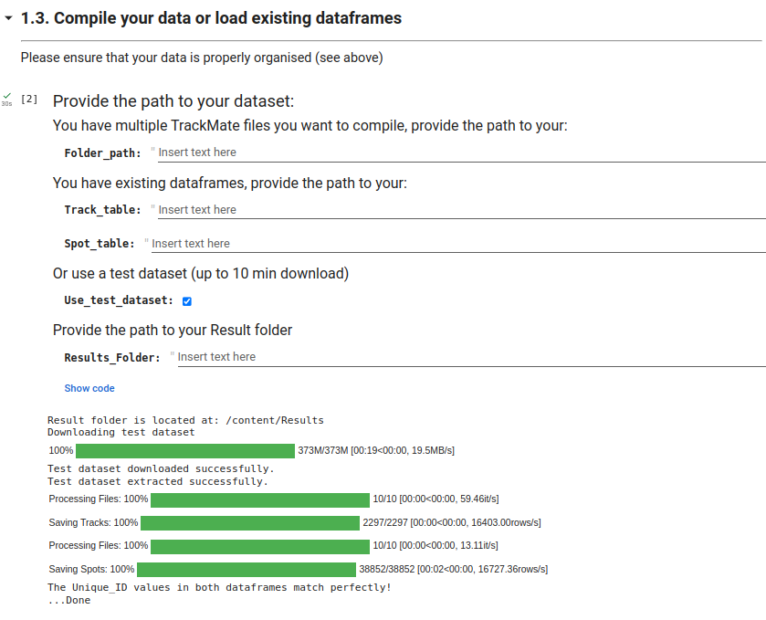
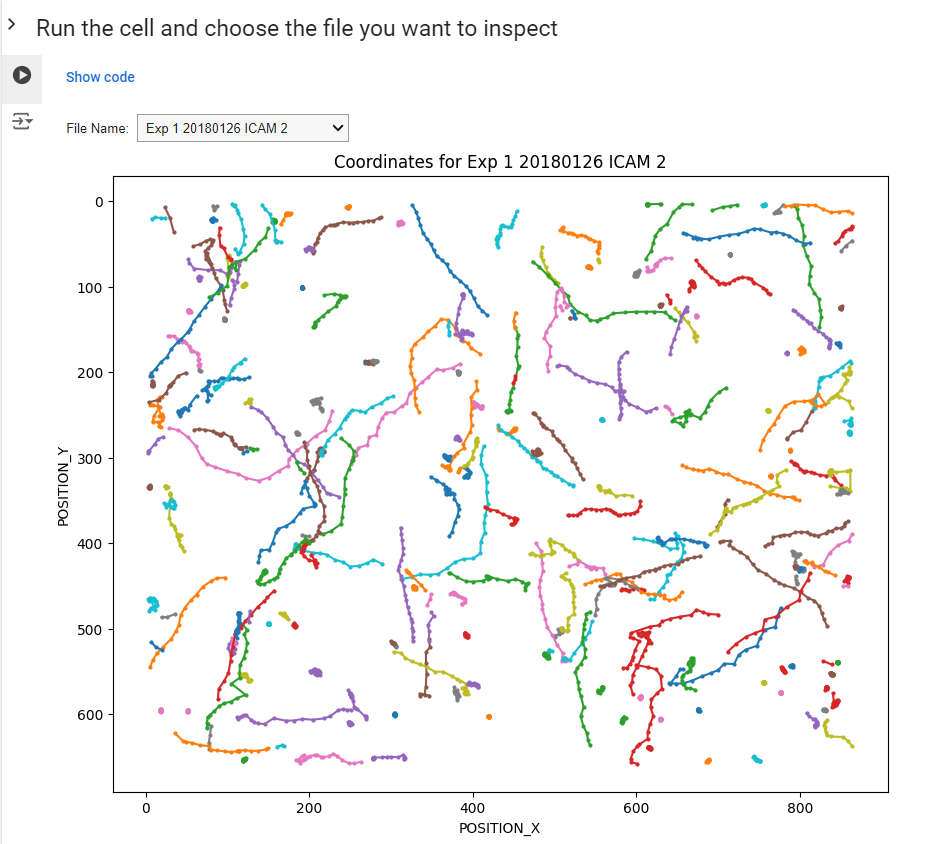
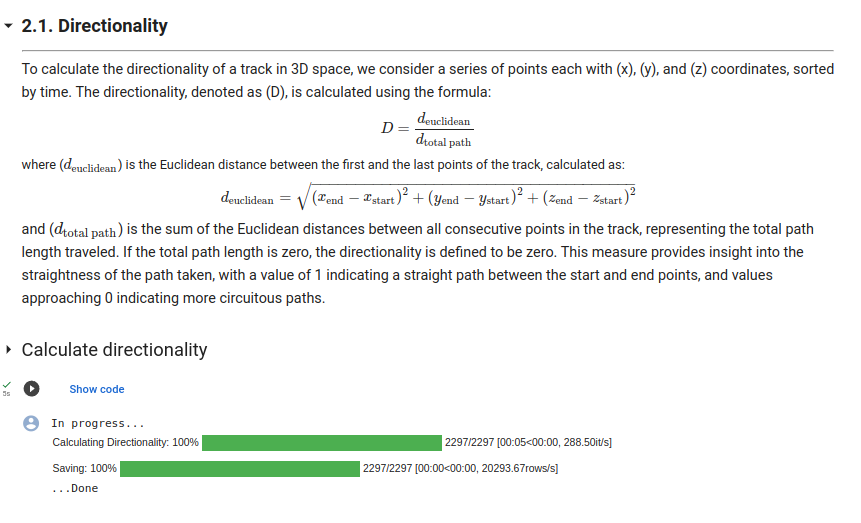
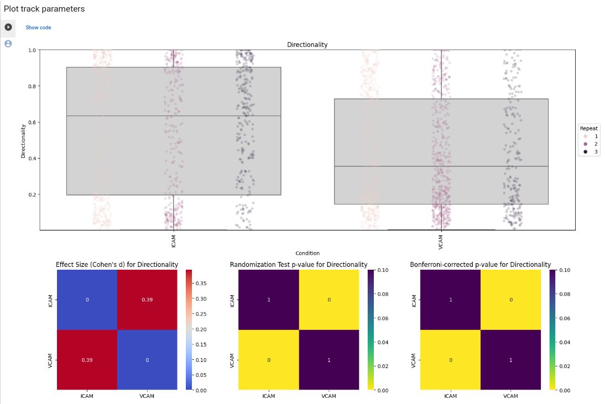
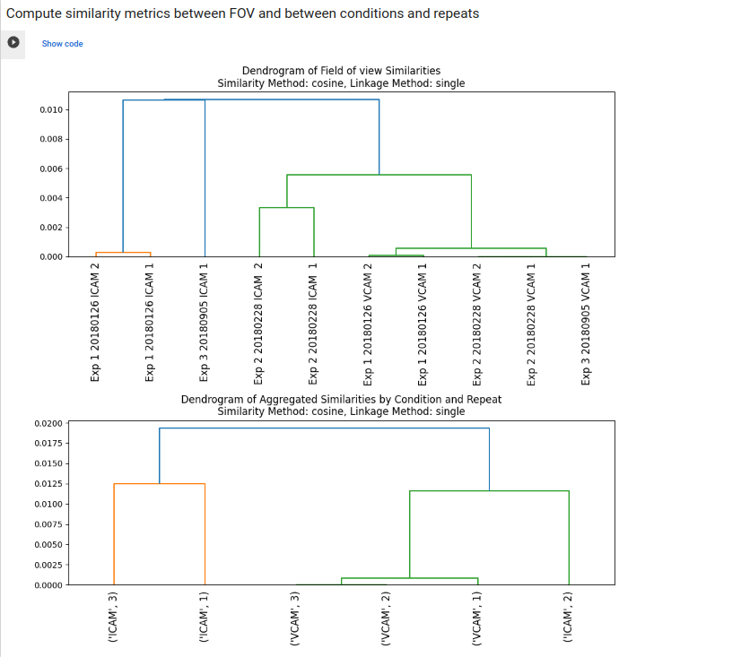
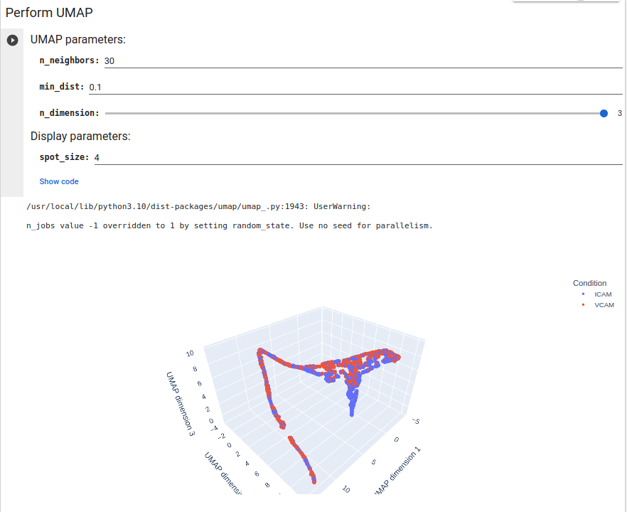
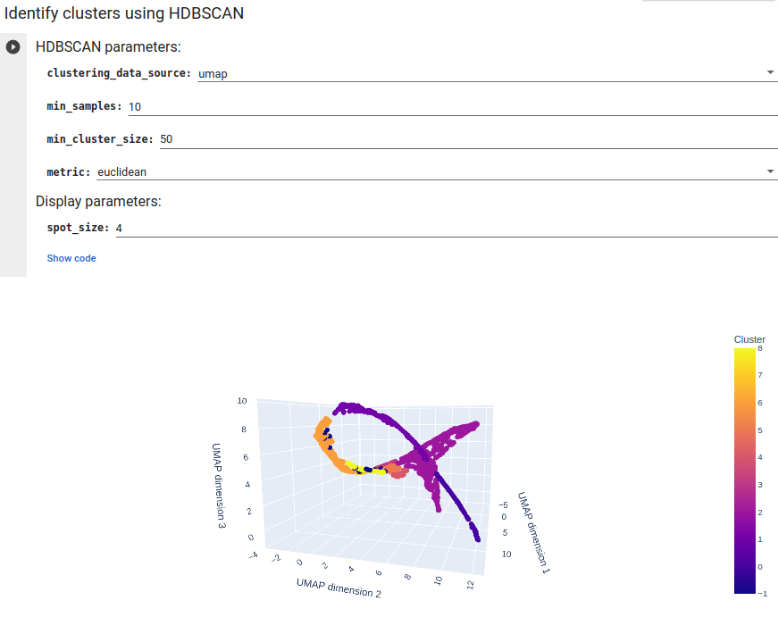
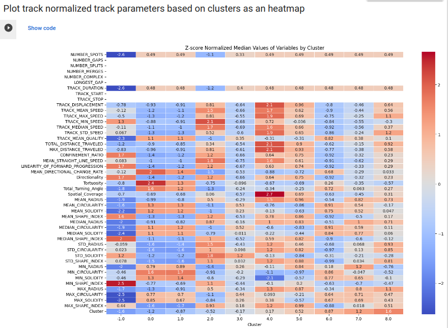

<table>
<tr>
<td valign="top">



</td>
<td>

> In life sciences, tracking objects from movies is pivotal for quantifying behaviors of particles, organelles, bacteria, cells, and whole animals. **CellTracksColab** bridges the gap between tracking and analysis.

> **CellTracksColab** simplifies the journey from data compilation to analysis.

</td>
</tr>
</table>


---

## 🚀 **Key Features**
- 📘 **Holistic View**: Comprehensive analysis across fields of view, biological repeats, and conditions.
- 🖥️ **User-Centric**: Intuitive GUI designed for all users.
- 🔍 **Visualization**: Track visualization and filtering.
- 📊 **Analysis**: Deep-dive into track metrics and statistics.
- 🧪 **Reliability**: Check experimental variability using hierarchical clustering.
- 🔧 **Advanced Tools**: Harness the power of UMAP, t-SNE, and HDBSCAN.
- 💼 **Flexibility**: Tailor and adapt to your needs.

---

## ✅ **Compatible with**
<table>
  <tr>
    <th><a href="http://imagej.net/TrackMate"></a></th>
    <th><a href="https://github.com/CellProfiler/CellProfiler"></a></th>
    <th><a href="http://icy.bioimageanalysis.org/"></a></th>
    <th><a href="https://www.ilastik.org/"></a></th>
    <th><a href="https://imagej.net/Fiji"></a></th>
  </tr>
  <tr>
    <td style="text-align: center;"><a href="http://imagej.net/TrackMate">TrackMate</a></td>
    <td style="text-align: center;"><a href="https://github.com/CellProfiler/CellProfiler">CellProfiler</a></td>
    <td style="text-align: center;"><a href="http://icy.bioimageanalysis.org/">Icy</a></td>
    <td style="text-align: center;"><a href="https://www.ilastik.org/">ilastik</a></td>
    <td style="text-align: center;"><a href="https://imagej.net/Fiji">Fiji Manual Tracker</a></td>
  </tr>
</table>

May also be compatible with other tracking software exporting tracking results that meet our minimal requirements. More info <a href="https://github.com/CellMigrationLab/CellTracksColab/wiki/The-Custom-notebook">here</a>.

## 📹 **Video Tutorials**

<table>
  <tr>
    <td>
      <a href="https://youtu.be/BzE_YPkgzSM" target="_blank">
        
      </a>
      <p style="text-align: center;">
        <strong>Tutorial 1:</strong> Getting Started with CellTracksColab using Google Colab
      </p>
    </td>
    <td>
      <a href="https://youtu.be/9vU8vjgTKqI" target="_blank">
        
      </a>
      <p style="text-align: center;">
        <strong>Tutorial 2:</strong> Using CellTracksColab locally using Jupyter
      </p>
    </td>
    <td>
      <a href="https://youtu.be/xZyVT2w15_c" target="_blank">
        
      </a>
      <p style="text-align: center;">
        <strong>Tutorial 3:</strong> Using CellTracksColab locally using Google Colab
      </p>
    </td>
    <td>
      <a href="https://youtu.be/fIE4i3G7L9Y" target="_blank">
        
      </a>
      <p style="text-align: center;">
        <strong>I2K 2024:</strong> CellTracksColab tutorial
      </p>
    </td>
  </tr>
</table>

> ℹ️ Tutorials 2 and 3 show the **previous** way of running CellTracksColab locally (manual Anaconda/Jupyter setup). The recommended local option is now the [CellTracksColab desktop app](#option-b-desktop-app-on-your-computer); see the Quick Start below.

<a id="quick-start"></a>
## 🛠️ **Quick Start**

CellTracksColab notebooks can run in two ways. The notebooks and analyses are the same in both; only where they run changes.

| | ☁️ **Google Colab** | 🖥️ **Desktop app (local)** |
|---|---|---|
| **Installation** | None. You need a web browser and a Google account | One-time installer for Windows, macOS or Linux (about 6–8 minutes) |
| **Your data** | Uploaded to your Google Drive, which the notebook connects to | Stays on your computer |
| **Computing** | Google's cloud machines (free tier, with session time limits) | Your own computer |
| **How to start** | Click an **Open in Colab** badge in the tables below | Install the app, launch **CellTracksColab**, and open a notebook from the Welcome dashboard |

### Option A: Google Colab (in your browser)

1. Pick a notebook from the tables below and click its  badge.
2. *(Recommended)* Save your own copy with `File > Save a copy in Drive`.
3. Run the **Load key dependencies** cell (section 1.1). In Colab it downloads CellTracksColab into the session and asks for permission to connect your Google Drive.
4. Point the notebook at your data on Drive (paths start with `/content/gdrive/MyDrive/`), or use the test dataset where the notebook offers one.

More details: [Running CellTracksColab using Google Colab](https://github.com/CellMigrationLab/CellTracksColab/wiki/Running-CellTracksColab-using-Google-Colab).

### Option B: Desktop app (on your computer)

The desktop app is built with [LabConstrictor](https://github.com/CellMigrationLab/LabConstrictor). It bundles Python, JupyterLab and every dependency, so you don't need to set up Conda or Python yourself.

1. **Install:** follow the [installation guide](.tools/docs/download_executable.md) for your operating system. Installers are also on the [Releases page](https://github.com/CellMigrationLab/CellTracksColab/releases).
2. **Launch:** open **CellTracksColab** from the Start Menu (Windows), the Applications folder (macOS) or your applications menu (Linux). A terminal window opens (keep it open while you work) and JupyterLab starts in your browser with the **Welcome** notebook.
3. **Open a notebook:** in the Welcome dashboard, click **Open the Notebook** next to the analysis you want. The Welcome notebook can also check for notebook updates.
4. **Run it:** your data stays on your computer. Paste the path of a local folder into the text box (on Windows and Linux you can also pick it with the folder selector). See [how to run notebooks in the desktop app](.tools/docs/code_hiding.md) to learn how to run cells when the code is hidden and how to show it with **Show/Hide Code**.

More details: [Using the notebooks after installation](.tools/docs/notebook_usage.md) · [Troubleshooting the desktop app](.tools/docs/troubleshooting.md).

<details>
<summary><b>Advanced: run from source in your own Python environment</b></summary>

If you prefer to manage your own environment (for example, to develop new analyses), create a conda environment ([Miniforge](https://conda-forge.org/download/) recommended) from this repository:

```bash
git clone https://github.com/CellMigrationLab/CellTracksColab.git
cd CellTracksColab
conda env create -f environment.yaml   # Python 3.12 + JupyterLab, environment "celltrackscolab"
conda activate celltrackscolab
pip install -r requirements.txt        # NVIDIA GPU users can use requirements_gpu.txt instead
pip install -e .                       # makes the `celltracks` package (in src/) importable
jupyter lab
```

Then open the notebooks in the `notebooks/` folder. Step-by-step instructions (including Google Colab with a local runtime) are on the wiki page [Running CellTracksColab locally](https://github.com/CellMigrationLab/CellTracksColab/wiki/Running-CellTracksColab-locally).

</details>

### 1. **Load and Plot Your Data**
We provide three notebooks for loading and analyzing your data depending on its format. The **Link** column opens each notebook in Google Colab. In the desktop app, all notebooks are listed in the Welcome dashboard.

<table>
  <tr>
    <th>Notebook</th>
    <th>Purpose</th>
    <th>Required File Format</th>
    <th>Link</th>
  </tr>
  <tr>
    <td><strong>CellTracksColab - TrackMate</strong></td>
    <td>Load and analyze TrackMate data. More info <a href="https://github.com/CellMigrationLab/CellTracksColab/wiki/The-TrackMate-notebook">here</a>.</td>
    <td>CSV or XML files</td>
    <td>
      <a href="https://colab.research.google.com/github/CellMigrationLab/CellTracksColab/blob/main/notebooks/CellTracksColab_TrackMate/CellTracksColab_TrackMate.ipynb">
        
      </a>
    </td>
  </tr>
  <tr>
    <td><strong>CellTracksColab - Custom</strong></td>
    <td>Analyze data from CellProfiler, ICY, ilastik, or Fiji Manual Tracker. More info <a href="https://github.com/CellMigrationLab/CellTracksColab/wiki/The-Custom-notebook">here</a>.</td>
    <td>CSV files</td>
    <td>
      <a href="https://colab.research.google.com/github/CellMigrationLab/CellTracksColab/blob/main/notebooks/CellTracksColab_Custom/CellTracksColab_Custom.ipynb">
        
      </a>
    </td>
  </tr>
  <tr>
    <td><strong>CellTracksColab - Viewer</strong></td>
    <td>Load and share data in the CellTracksColab format.</td>
    <td>CellTracksColab format</td>
    <td>
      <a href="https://colab.research.google.com/github/CellMigrationLab/CellTracksColab/blob/main/notebooks/CellTracksColab_Viewer/CellTracksColab_Viewer.ipynb">
        
      </a>
    </td>
  </tr>
</table>

### 2. **Advanced Analysis Modules**

These notebooks require your dataset to be in the CellTracksColab format.

<table>
  <tr>
    <th>Notebook</th>
    <th>Purpose</th>
    <th>Required File Format</th>
    <th>Link</th>
  </tr>
  <tr>
    <td><strong>CellTracksColab - Dimensionality Reduction</strong></td>
    <td>Utilize advanced dimensionality reduction techniques.</td>
    <td>CellTracksColab format</td>
    <td>
      <a href="https://colab.research.google.com/github/CellMigrationLab/CellTracksColab/blob/main/notebooks/CellTracksColab_Dimensionality_Reduction/CellTracksColab_Dimensionality_Reduction.ipynb">
        
      </a>
    </td>
  </tr>
  <tr>
    <td><strong>CellTracksColab - Track Spatial Clustering Analysis</strong></td>
    <td>Dive deeper into your dataset with track clustering analysis.</td>
    <td>CellTracksColab format</td>
    <td>
      <a href="https://colab.research.google.com/github/CellMigrationLab/CellTracksColab/blob/main/notebooks/CellTracksColab_Track_Clustering/CellTracksColab_Track_Clustering.ipynb">
        
      </a>
    </td>
  </tr>
  <tr>
    <td><strong>CellTracksColab - Distance to ROI</strong></td>
    <td>Analyze movement tracks in relation to designated ROIs.</td>
    <td>CellTracksColab format</td>
    <td>
      <a href="https://colab.research.google.com/github/CellMigrationLab/CellTracksColab/blob/main/notebooks/CellTracksColab_Distance_to_ROI/CellTracksColab_Distance_to_ROI.ipynb">
        
      </a>
    </td>
  </tr>
</table>

More to come

##  Other Notebooks

#### CellTracksColab - TrackMate - Plate:
  - Handle TrackMate CSV files structured in a plate format, such as file names commonly produced by incubator microscopes like Incucytes.
  - [](https://colab.research.google.com/github/CellMigrationLab/CellTracksColab/blob/main/notebooks/CellTracksColab_TrackMate_Plate/CellTracksColab_TrackMate_Plate.ipynb)
    
---

## 🧩 **Napari and Fiji (experimental, branch `bridge-test`)**

The installer registers the **Calculate Track Metrics** tool (`src/celltracks_lc_tools`) so that it appears in the generic
[napari-labconstrictor](https://github.com/CellMigrationLab/napari-labconstrictor) widget and the
[LabConstrictor-Fiji](https://github.com/CellMigrationLab/LabConstrictor-Fiji) command: choose a tracks CSV, get the per-track metrics
table. The tool runs in CellTracksColab's own environment. To try it by hand on your computer follow the [human test protocol](https://github.com/CellMigrationLab/LabConstrictor-Tools/blob/main/docs/HUMAN_TEST_PROTOCOL.md). Details and tests: [`lc_tests/README.md`](lc_tests/README.md) and
[LabConstrictor-Tools](https://github.com/CellMigrationLab/LabConstrictor-Tools).

---

## ⭐️ **Acknowledgments**

CellTracksColab is inspired by several key projects in cell tracking and analysis. We acknowledge the influential contributions of **[Traject3d](https://www.nature.com/articles/s41467-022-32958-x)**, **[CellPhe](https://www.ncbi.nlm.nih.gov/pmc/articles/PMC10070448/)**, **[CelltrackR](https://www.sciencedirect.com/science/article/pii/S2667119021000033)**, the **[MotilityLab website](https://www.motilitylab.net/)**, and **[Cellplato on Zenodo](https://zenodo.org/records/8096717)**. The innovative use of UMAP and HDBSCAN for analyzing tracking data, as featured in CellTracksColab, was first introduced in **[CellPlato](https://github.com/Michael-shannon/cellPLATO)**.

---
## 📦 **Resources**
- **Test Dataset**: Start exploring with our test datasets in [CellTracksColab CSV format](https://zenodo.org/records/8420011), or [TrackMate CSV format](https://zenodo.org/records/8413510).
- **Data Structure**: Organize with our two-tiered folder hierarchy. [Details here](https://github.com/CellMigrationLab/CellTracksColab/wiki/Data-requirements-and-supported-software).
- **Data Requirements**: Note that **CellTracksColab** does not yet support track merging or splitting.

---

## 📚 **Documentation**

- 📖 **CellTracksColab analysis documentation:** [Visit the comprehensive wiki](https://github.com/CellMigrationLab/CellTracksColab/wiki).
- ☁️ **Running in Google Colab:** [Colab guide](https://github.com/CellMigrationLab/CellTracksColab/wiki/Running-CellTracksColab-using-Google-Colab).
- 🖥️ **Installing the desktop app:** [Installation guide](.tools/docs/download_executable.md) (Windows, macOS and Linux, including how to uninstall).
- 📓 **Using notebooks in the desktop app:** [Notebook usage guide](.tools/docs/notebook_usage.md) · [Running cells with hidden code](.tools/docs/code_hiding.md).
- 🛠️ **Problems with the desktop app:** [Troubleshooting guide](.tools/docs/troubleshooting.md).

---

## ✍️ **Contributors**

- [Estibaliz Gómez-de-Mariscal](https://esgomezm.github.io/)
- [Hanna Grobe](https://www.abo.fi/en/contact/hanna-grobe/)
- [Joanna W. Pylvänäinen](https://research.abo.fi/en/persons/joanna-pylv%C3%A4n%C3%A4inen)
- [Laura Xénard](https://research.pasteur.fr/en/member/laura-xenard/)
- [Ricardo Henriques](https://henriqueslab.github.io/)
- [Jean-Yves Tinevez](https://research.pasteur.fr/en/member/jean-yves-tinevez/)
- [Guillaume Jacquemet](https://cellmig.org/)

---

## 🤝 **Contribute**

We welcome your insights and improvements! There are several ways you can contribute to the CellTracksColab project:

### Issues
If you encounter any bugs, have suggestions for improvements, or want to discuss new features, please raise an issue on our [GitHub Issues page](https://github.com/CellMigrationLab/CellTracksColab/issues).

### New Analysis Notebooks
We are excited to see new analysis notebooks built on the CellTracksColab platform. If you have developed a new notebook, please submit it via a pull request. All submitted notebooks should include a test dataset to showcase their functionality. Each notebook will be tested by a member of the team before being released.

### Code of Conduct
We expect all contributors to adhere to our simple code of conduct:

- Be respectful and considerate of others.
- Provide constructive feedback.
- Collaborate openly and honestly.

By participating in this project, you agree to abide by these guidelines.

---

Thank you for contributing to CellTracksColab! Your support and contributions help us improve and expand the platform for everyone in the community.

---

## **License**
Licensed under the MIT License. [Details here](LICENSE).

---

## 📜 **Citation**

If you use CellTracksColab in your research, please cite the following paper:

### Reference

Gómez-de-Mariscal, E., Grobe, H., Pylvänäinen, J. W., Xénard, L., Henriques, R., Tinevez, J.-Y., & Jacquemet, G. (2024). CellTracksColab is a platform that enables compilation, analysis, and exploration of cell tracking data. *PLOS Biology*. Published August 8, 2024. https://doi.org/10.1371/journal.pbio.3002740


## 🖼️ **Screenshots**

<table>
<tr>
    <td align="center" valign="middle">
        
        <br>
        <em>Figure 1: Compile your data</em>
    </td>
    <td align="center" valign="middle">
        
        <br>
        <em>Figure 2: Visualise your tracks</em>
    </td>
</tr>
<tr>
    <td align="center" valign="middle">
        
        <br>
        <em>Figure 3: Compute additional metrics</em>
    </td>
    <td align="center" valign="middle">
        
        <br>
        <em>Figure 4: Plot track parameters</em>
    </td>
</tr>
<tr>
    <td align="center" valign="middle">
        
        <br>
        <em>Figure 5: Compute Similarity Metrics between Field of Views and between Conditions and Repeats</em>
    </td>
    <td align="center" valign="middle">
        
        <br>
        <em>Figure 6: Perform UMAP</em>
    </td>
</tr>
<tr>
    <td align="center" valign="middle">
        
        <br>
        <em>Figure 7: Identify clusters using HDBSCAN</em>
    </td>
    <td align="center" valign="middle">
        
        <br>
        <em>Figure 8: Understand your clusters using a heatmap</em>
    </td>
</tr>
</table>


---


